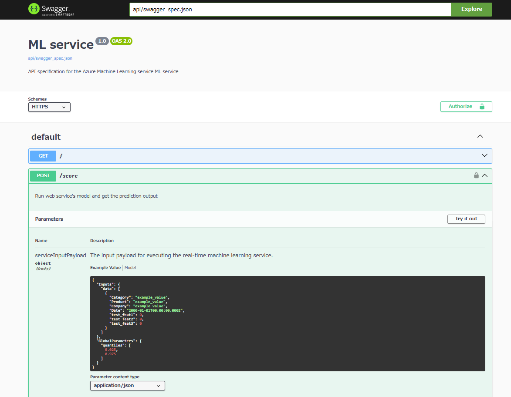

# Point
this app is useful to visualize swagger.json via restapi and docker.

### folder configuration
- `swagger`: 
  - there's auto-created file `swagger_spec.json` in `swagger` folder every time you execute `CheckMoeSchema.ps1` 
  - DO NOT DELETE this folder

- `testdata`:
  - in AutoML mlflow model case, there's not example testdata schema in swagger.json. 
  - if your senario matches this case,  you need to put the test data (.csv) you wanna use in `testdata` folder

- `CheckMoeSchema.ps1`:
  - it's to download swagger.json via rest api and start up swagger ui app. 

### requirements
- you can run `python` command at local-machine terminal
- you can run `docker` command at the same as above.

### execution step
1. execute git clone at specified folder
1. `python -m venv .venv`
1. `.\.venv\Scripts\activate`
1. `pip install pandas`
1. `Set-ExecutionPolicy Unrestricted -Scope CurrentUser -Force`  ※ for any users to execute this ps script. 
1. `./CheckMoeSchema.ps1`
  1. "Enter the REST endpoint:" is moe scoring REST ENDPOINT `https://<YOUR ENDPOINT>.<REAGION.inference.ml.azure.com/score`
  1. "Enter the Deployment NAME:" is your moe deployment name
  1. "Enter the API key:" is your moe api key

###### example
</img>